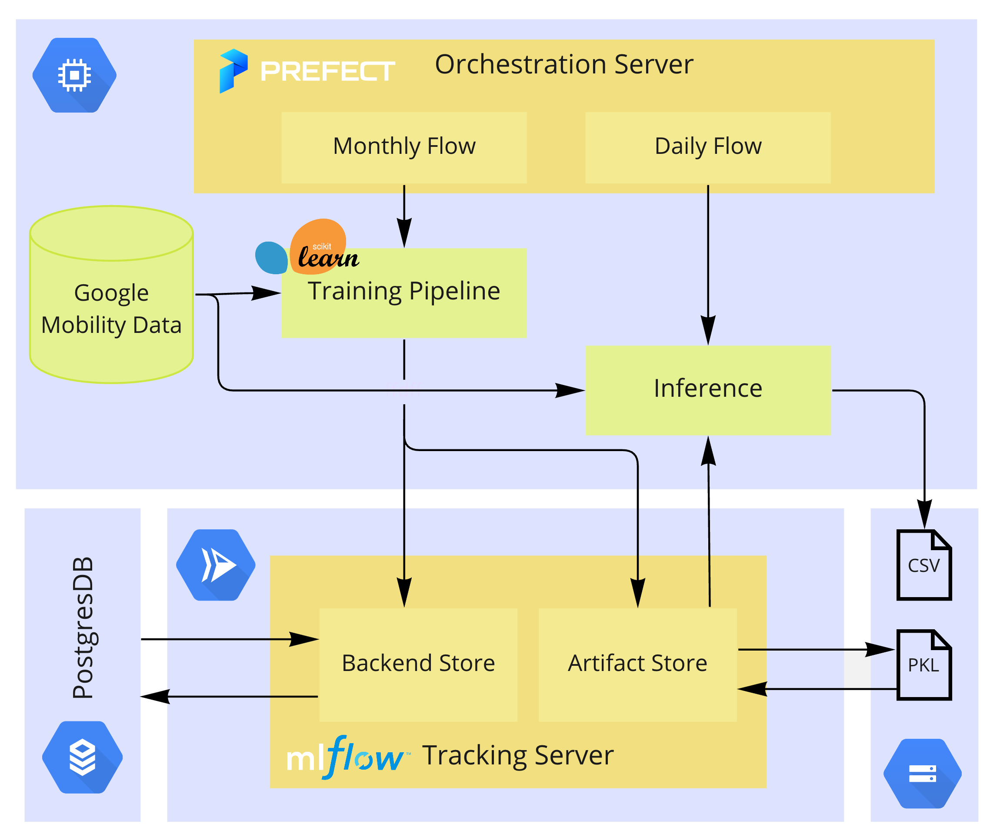

# MLOps Zoomcamp Project

## Overview

This project consists of an application that forecasts the mobility trends for retail & recreation in Portugal using  [Google's Community Mobility Reports](https://www.google.com/covid19/mobility). According to Google, this includes places like restaurants, cafes, shopping centers, theme parks, museums, libraries, and movie theaters.

This project aims to be a proof of concept for an application that allows restaurant owners to have better predictions on consumer demand.

Currently, the model only leverages past mobility data but in the future the objective is to integrate other data sources such as holidays and weather forecasts.

The main focus of the project is on the operations side which is what the course mainly covers. As can be seen on the diagram below, the project leverages Prefect as an orchestration engine to run the predictions everyday for the following days which are stored on a bucket. The model is automatically re-trained on a monthly basis to adjust for distribution shifts. Model training is integrated with MLFlow for tracking and registry. All of these operations run on GCP.

<p align="center">
  
</p>

___

## Guide

### MLFlow

MLFlow is used to store the models as well as their corresponding metadata. This is specially important given the monthly retraining, it's important to keep track of the several models that are being trained on a standard location and have an easy way to roll back if necessary.

I decided to set it up using Cloud Run and I mostly followed this [blogpost](https://dlabs.ai/blog/a-step-by-step-guide-to-setting-up-mlflow-on-the-google-cloud-platform/
). My implementation is on the mlflow submodule.


### Prefect

Prefect is going to be the brain of our app, it's where the monthly retraining and the daily inference will occur. 

Let's start by creating a VM on GCP and setting up the environment:

```
conda create -n project python=3.9
conda activate project
pip install -r requirements.txt
```

Afterwards we need to spin the Prefect server with:

```
prefect orion start
```

Then we need to build the YAMLs:

```
prefect deployment build train.py:train_flow --name model_train
prefect deployment build predict.py:train_flow --name model_predict
```

Then we can deploy the flows:
```
prefect deployment apply model_train-deployment.yaml 
prefect deployment apply model_predict-deployment.yaml 
```

Finally, we start an agent that will run the deployed flows:
```
prefect agent start -q 'forecasting'
```
